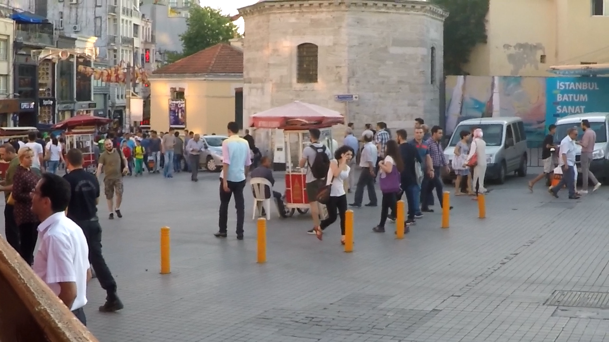

# de_blur_gan

This repository contains the implementation of a Generative Adversarial Network (GAN) model for image restoration (deblurring). The code has been written in PyTorch.

## Requirements

`requirements.txt`  includes all the necessary libraries that are needed to run this project. To install copy the following command.
```
pip install -r requirements.txt
```

## Modules

`train.py`: Python script to train the model.

`deblur_modules/` folder:

`config.py`: To set configuration options and hyperparameter values.

`data_loader.py`: Dataloader class.

`losses.py`: All the needed loss functions to train the dataset.

`models.py`: Implemented neural network architectures for the generator and the discriminator models.

`organize_gopro_dataset.py`: Convert subfolders of the dataset into sharp and blurry images.


## Dataset and Data Preparation

The [GoPro Dataset](https://seungjunnah.github.io/Datasets/gopro) has been used to train the model. There are two versions of the dataset available, with differences in their volume. You can use either one of them based on your hardware and needs.

The dataset contains two folders `train` and `test`. Each folder contains several subfolders, and each subfolder has its corresponding images. `train_samples.csv` and `test_samples.csv` in `/data` include a list of subfolders and their corresponding images.

If you want to organize the dataset in a way that separates sharp and blurry images into two folders, you can run the `deblur_modules/organize_gopro_dataset.py` module. This module will convert subfolders into sharp and blur images. The following is the code to run this module for your convenience.

```
cd deblur_modules/
python organize_gopro_dataset.py --dir_in="dataset directory" --dir_out="target directory"
```

A sample of the dataset

Blurry image

Sharp image

